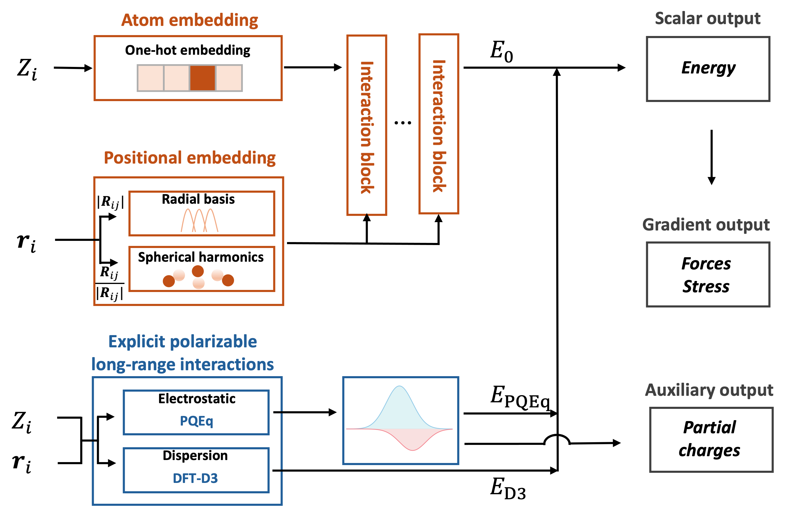

<h1>ReaxNet</h1>

 
<a href='https://arxiv.org/abs/2410.13820'></a>

<p align="center">

</p>

**ReaxNet** package is a JAX implementation of polarizable long-rang interactions integrated equivariant neural network potential.

## Framework overview


## Installation

### Easy install

```bash
pip install git+https://github.com/reaxnet/reaxnet.git
```

### Advanced install (recommend)

For NVIDIA-GPU acceleration, you should compile the JAX library with CUDA support. Please refer to the [JAX installation guide](https://jax.readthedocs.io/en/latest/installation.html#installation) for other platforms acceleration.

```bash
pip install -U "jax[cuda12]"
pip install git+https://github.com/reaxnet/reaxnet.git
```

## Usage

### Basic usage
The basic usage of **ReaxNet** is demonstrated in the [basic.ipynb](./examples/basic.ipynb) notebook. Please note that you should carefully read the [jax-md](https://github.com/jax-md/jax-md) codes when using the neighbor list.

### Fine-tuning the pretrained model
We provide a pretrained model, which can be used to fine-tune on your own dataset. The detailed fine-tuning process can be found in the [fine_tuning.ipynb](./examples/fine_tuning.ipynb).

### Example notebooks:
| Notebooks | Descriptions |
| -------- | ----------- |
| [basic.ipynb](./examples/basic.ipynb) | Examples for prediction of energy and forces for atomic structure. |
| [non_bond.ipynb](./examples/non_bond.ipynb) | Examples for calculation of polarizable long-range interactions. |
| [fine_tuning.ipynb](./examples/fine_tuning.ipynb) | Examples for fine-tuning the pretrained model. |

## Code test environment
### Python Dependencies
- Python 3.9
- [JAX](https://github.com/jax-ml/jax) 0.4.20
- [JAX-MD](https://github.com/jax-md/jax-md) 0.2.8
- [NumPy](https://numpy.org/) 1.23.4
- [ASE](https://gitlab.com/ase/ase) 3.23.0
- [e3nn_jax](https://github.com/e3nn/e3nn-jax) 0.20.7
- [flax](https://github.com/google/flax) 0.10.0
- [jraph](https://github.com/google-deepmind/jraph) 0.0.6
- [optax](https://github.com/google-deepmind/optax) 0.1.8
- [matscipy](https://github.com/libAtoms/matscipy) 1.0.0

### OS 
The code has tested on:
- Ubuntu 22.04.4 LTS
- MacOS 14.7

## Reference

If you use this repository, please cite the following [preprint](https://arxiv.org/abs/2410.13820):
```bib
@article{reaxnet,
  title={A foundation machine learning potential with polarizable long-range interactions for materials modelling},
  author={Gao, Rongzhi and Yam, ChiYung and Mao, Jianjun and Chen, Shuguang and Chen, GuanHua and Hu, Ziyang},
  journal={arXiv preprint arXiv:2410.13820},
  year={2024}
}
```
